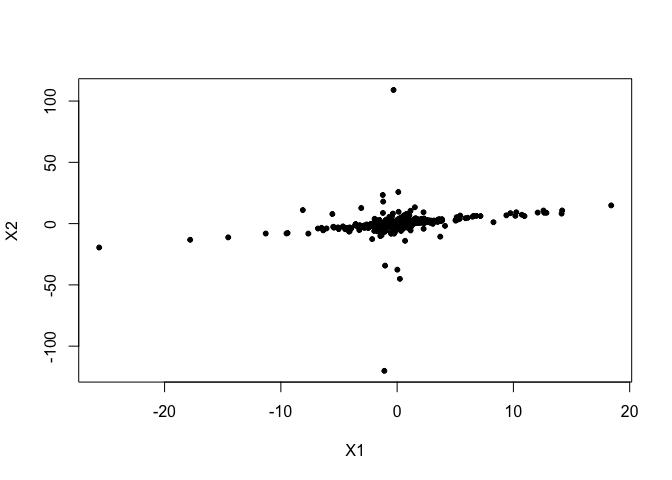

<!-- README.md is generated from README.Rmd. Please edit that file -->
causalXtreme
============

<!-- badges: start -->
[](https://www.tidyverse.org/lifecycle/#maturing) [](https://travis-ci.org/nicolagnecco/causalXtreme) <!-- badges: end -->

The goal of causalXtreme is to provide an interface to perform causal discovery in linear structural equation models (SEM) with heavy-tailed noise. For more details see the paper "Causal discovery in heavy-tailed models" from Gnecco, N., Meinshausen, N., Peters, J., and, Engelke, S.

Installation
------------

<!-- You can install the released version of causalXtreme from [CRAN](https://CRAN.R-project.org) with: -->
<!-- ``` r -->
<!-- install.packages("causalXtreme") -->
<!-- ``` -->
You can install the development version from [GitHub](https://github.com/) with:

``` r
# install.packages("devtools")
devtools::install_github("nicolagnecco/causalXtreme")
```

Example
-------

Let us first generate a SEM with two Student-t variables with 1.5 degrees of freedom (i.e., heavy-tailed).

``` r
library(causalXtreme)
## basic example code
set.seed(1)
sem <- simulate_data(n = 500, p = 2, prob_connect = 0.5,
                     distr = "student_t", tail_index = 1.5)
```

Let us investigate the randomly generated directed acyclic graph (DAG) induced by the SEM.

``` r
sem$dag
#>      [,1] [,2]
#> [1,]    0    1
#> [2,]    0    0
```

We see that the first variable causes the second variable, since the entry (1, 2) of the matrix `sem$dag` is equal to 1. We can plot the simulated dataset.



At this point, we can compute the *causal tail coefficients* between the two variables *X*<sub>1</sub> and *X*<sub>2</sub>.

``` r
causal_tail_matrix(dat = sem$dataset)
#>           [,1]      [,2]
#> [1,]        NA 0.9201667
#> [2,] 0.6343333        NA
```

We see that the coefficient *Γ*<sub>12</sub> ≈ 1 (entry (1, 2) of the matrix) and *Γ*<sub>21</sub> &lt; 1 (entry (2, 1) of the matrix). This is evidence for a causal relationship from *X*<sub>1</sub> to *X*<sub>2</sub>.

We can also run the *extremal ancestral search* (EASE) algorithm, based on the causal tail coefficients. The algorithm estimates from the data a causal order for the DAG.

``` r
ease(dat = sem$dataset)
#> [1] 1 2
```

In this case, we see that the estimated causal order is correct, since the cause *X*<sub>1</sub> is placed before its effect *X*<sub>2</sub>.
